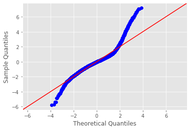
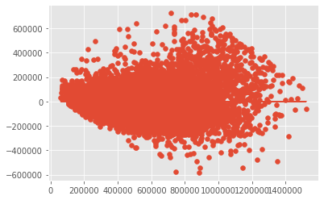
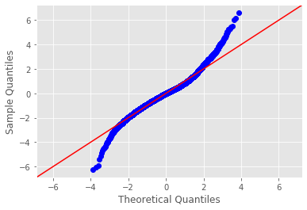
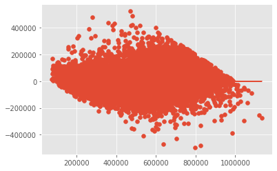
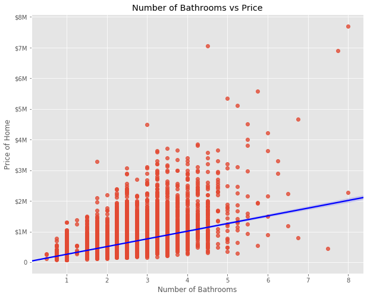
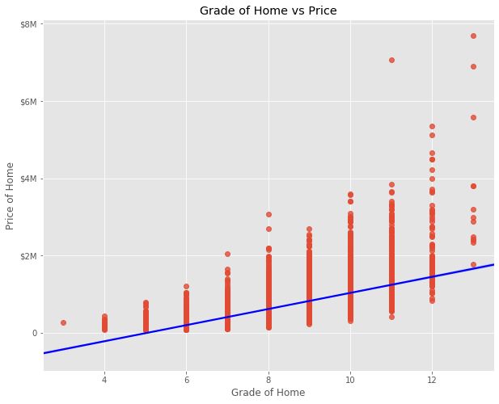
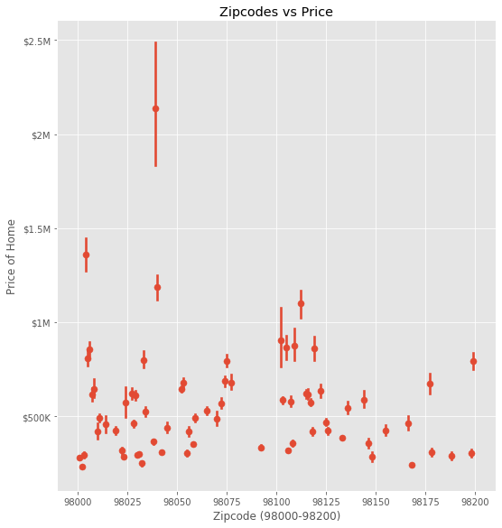

# Module 2 Final Project

## Introduction

Throughout the project we'll clean, explore, and model a dataset with a multivariate linear regression to predict the sale price of houses as accurately as possible. We will view, interpret and create a regression model with the information to help home owners interpret how they can increase and or invest in their property value. as we make our way through the analysis we'll find the bathrooms, zip codes and grade of a home are some of the most important values when it comes to pricing within this given dataset.

## The Dataset (Obtaining the data)

For this project, I'll be working with the King County House Sales dataset. This dataset holds information on King's County in Washington State. The dataset is made up of the following columns:
* ID
* Date
* Price
* bedrooms
* bathrooms
* sqrft_living (square footage of entire living space)
* sqft_lot (swaure footage of plot of land)
* floors
* waterfront
* view
* condition
* grade
* sqft_above (square footage above the first floor)
* sqft_basement (square footage of the basement)
* yr_built
* yr_renovated
* zipcode
* lat
* long
* sqft_living15 (square footage of living space in nearest 15 homes)
* sqft_lot15 (square footage of lots in nearest 15 homes)

## Cleaning Data (Scrub)
I needed to view the data to make sure there were no null values, random strings and outliers that would impact our information negatively. To do this I needed to:
* Remove any unnecessary columns that didn't fit what we were solving for (id, lat, long).
* Converted date to pd.to_datetime.
* Removed special characters like '?' (Represented <2% of the data)
* Checked for Null values and either removed the rows in its entirety or filled them with zeroes.
* Seperated my columns based on categorial data and Numerical data (used the histogram visuals to come up with why I chose the respective column in their respective dataframe.
* Removed outliers from df_num using the Z Score Method in each the categorical and numerical dataframe.
* Finally, I concatonated df_num and df_cat to make df_clean.

## Exploring Data
I wanted to get an understanding of some of the correlations occuring post cleaning my data. I went through a .describe()method and then viewed my all my data in df_clean in a histogram. This allowed me to view how my data became more normalized after all the cleaning I did prior.

## Modeling Data
Finally I needed to model my data using the OLS formula. I prebaked the formula before using the actual 'ols()'. Once this was compelted I could now interpret how accurate my data. It's recommended to have R^2 of .5 of greater. After cleaning teh data and normalizing it, I was able to achieve an R^2 of .83.

I needed to graph the model and look check for homoscedasticity. Overall the homoscedasticity looked in line with what I was trying to model. But the tails on the regression line visual were a little too far away from what I was looking to achieve. I needed to remove some of the residuals so I took all of the data with a price < 1,000,000. This would remove some of those outlier residuals. Once I completed the second OLS Model, the tails looked more normal and our homoscedasticity stayed in tact. Below you can see the models:

OLS 1

OLS 2

## Interpreting the Data

After concluding we were able to accurately identify how pricing can drastically change from the amount of bathrooms you have, zip codes you live in and the grade of your home. After normalizing, using z-score methods and cleaning our data we came to the following coefficient results.

Having just one bathroom added or subtracted from your home can change the value of your home by $19,540.

Having your home be graded below 10 can cost your value of the home by a minimum of $16,050.

Finally whether it be selling or purchasing a home you'd want it to be located in these three zipcodes:

98119 ($388.7k)

98109 ($387.2k)

98112 ($397.5k)

Given the information above we can make recommendations on the above topics (bathrooms, grade, zip code) and present the visuals below to drive impact.

